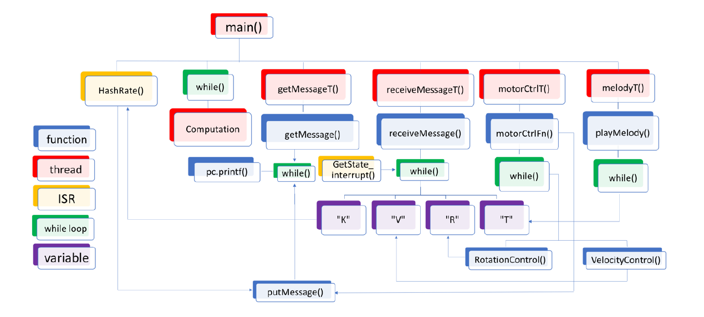

# Embedded_System_CW2

This is 3rd year Embedded Systems 2nd coursework. This courserwork mainly focuses on controlling a brushless and synchronous motor which use non-contract methods to switch windings.

## Specification

By the end of the project, the motor should perform the following functionalities:

- The motor should spin for a defined number of rotations and stop without overshooting with a precision of 0.5 rotations for number of rotations.
- The motor should spin at a defined maximum angular velocity of 5–100 rotations per second, with a precision of 0.5 rotations per second.
- The system should perform a Bitcoin mining task and test 5000 nonces per second. Matching nonces needs to be sent back to the host.
- The motor will play a melody while it is spinning by modulating the drive current. The melody is a repeating sequence of notes in the C4 octave with durations of 0.125–1 seconds.

## Structure

```
├── EE3-24_ES_CW2_report.pdf
├── bitcoin.cpp
├── bitcoin.h
├── main.cpp
├── mbed-os.lib
├── motor.cpp
├── motor.h
├── msg.cpp
├── msg.h
├── tune.cpp
└── tune.h
```
`EE3-24_ES_CW2_report.pdf` contains the analysis of the dependencies, task deadlines, priorities and utilisation of the system. `bitcoin.cpp/h` files contain the bitcoin mining task. `motor.cpp/h` files define the motor control. `tune.cpp/h` files define the melody play of the motor. Threads and a main function are then defined in the `main.cpp ` file.

## Architecture of the System

The following dependency graph illustrates the overall architecture of the system. 



